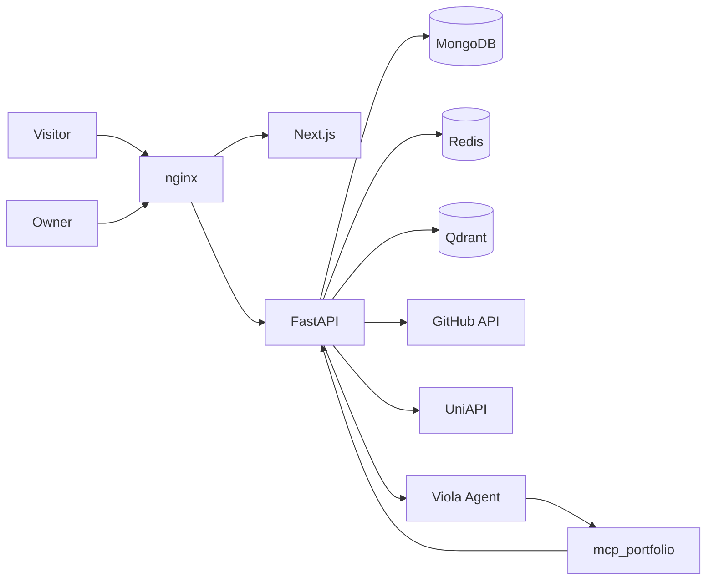
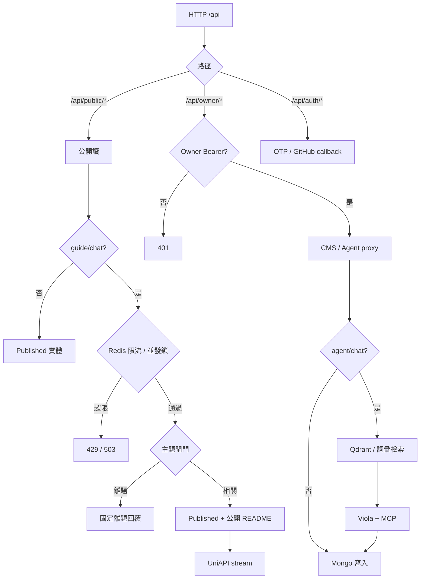

# Personal Portfolio

求職向個人作品集：Next.js 公開站與 CMS、FastAPI 系統紀錄、Viola Owner Agent，以及側欄只讀 Portfolio Guide。訪客先看到「我是誰、做過什麼」，再透過文章與日誌看見思考深度。

[](backend/Dockerfile)
[](backend/README.md)
[](frontend/package.json)
[](docs/deploy.md)

公開預設語系為 `zh-Hant`，殼層另提供 `zh-Hans` 與 `en`。內容欄位在 CMS 中分三語維護；公开展示按當前語系取原文，缺則回退，中文之間只做字形轉換。

## 功能亮點

- **公開作品集**：Profile、About 模組、Published Project / Article / Journal、審核後留言。
- **Owner CMS**：信箱 OTP 登入；三語 Markdown、機翻輔助、頭像與內容圖上傳。
- **GitHub 源碼瀏覽**：Project 可綁 SourceRepo；公開倉提供 README / 分支 / tree / blob，私有倉不對訪客代理檔案。
- **Owner Agent**：後台持久對話、檔案上傳、MCP 讀寫 CMS（新建一律 Draft；Owner 明確要求時可發布，無刪除工具）、「關於我」RAG。
- **公開導覽**：側欄玻璃抽屜，只讀 Published 內容與公開 README；Redis 限流與主題閘門，不暴露 Owner 權限。
- **單機部署**：nginx 終止 TLS，反向代理到 Next.js 與 FastAPI；Mongo、Redis、Qdrant、Viola 同機 Compose。

## 架構



| 元件 | 職責 |
| --- | --- |
| `frontend` | 公開站、CMS、Agent 工作區、公開導覽抽屜 |
| `backend` | HTTP 系統紀錄、OTP、GitHub 代理、RAG、公開 Guide 閘門 |
| `viola-agent` | Owner Agent 推理與工具迴圈；無公開埠 |
| `mcp_service` | `mcp_portfolio`：以服務 token 呼叫 Owner API |
| MongoDB | Profile / Project / Article / Journal / Comment / 對話 / 知識正文 |
| Redis | OTP、session、GitHub 快取、公開導覽限流與並發鎖 |
| Qdrant | 「關於我」向量；失敗時關鍵詞檢索降級 |
| UniAPI | Chat（`gemini-2.5-flash`）與 Embedding（`text-embedding-3-small`） |
| nginx | `:80/:443` 入口；`/` → web，`/api/` → API |

### 入站決策



| 開關 | 作用 |
| --- | --- |
| `PUBLIC_AGENT_ENABLED` | 關閉公開導覽而不影響 CMS |
| `MAIL_BACKEND` | `console` / `smtp` / `resend` |
| `PORTFOLIO_WRITE_ENABLED` | MCP 寫入；Compose 生產為 `true` |
| `UNI_API_KEY` | 缺則 Owner RAG 與公開 Guide 無法呼叫模型 |

## 本版本：硬編碼 Prompt 與大模型（1.0.14）

> 運行時以 `deployment/.env` 為準；下表為本版本基線。  
> **憲法原則**：凡修改 prompt 模板或變更本節記載的大模型基線，必須在同一變更集更新本節、新增版本檔，並更新 [docs/prompt-model-versions/](docs/prompt-model-versions/)。

| 角色 | 模型 | 來源 | 環境變數 | 載入入口 |
| --- | --- | --- | --- | --- |
| Owner Agent chat | `gemini-2.5-flash` | UniAPI | `VIOLA_AGENT_MODEL` | `docker-compose.prod.yml` → Viola `serve` |
| Public Guide chat | `gemini-2.5-flash` | UniAPI | `PUBLIC_AGENT_MODEL` | `backend/app/public_agent.py` |
| RAG embedding | `text-embedding-3-small`（回退 `gemini-embedding-001` / `text-embedding-004` / `jina-embeddings-v3`） | UniAPI | `AGENT_EMBEDDING_MODEL` | `backend/app/agent_rag.py` |

| Prompt | 路徑 |
| --- | --- |
| Owner 系統規則 | [`viola-agent/viola/templates/AGENTS.md`](viola-agent/viola/templates/AGENTS.md) |
| Owner 性格 / Voice | [`viola-agent/viola/templates/SOUL.md`](viola-agent/viola/templates/SOUL.md) |
| Owner 工具說明 | [`viola-agent/viola/templates/TOOLS.md`](viola-agent/viola/templates/TOOLS.md) |
| Public Guide 系統提示 | [`backend/app/public_agent.py`](backend/app/public_agent.py) `_system_prompt()` |
| Intent 分類 | [`docs/agents/agent-intents.md`](docs/agents/agent-intents.md) |

Owner 預設 `max_tokens=4096`。会话只回放最近约 16 条消息，上下文窗口 32k；跨对话记忆是「关于我」RAG 里的短事实，不是聊天记录。首页走 SiteProfile（`get_site` / `update_site`），About 是 `/about` 模块，不是名叫 `main` 的页面。查看或整理 About 页时同一轮 `list_content` kind=`about`；若模型只预告「我先看看」而不调工具，运行时会恢复该调用。新建内容保持 Draft，仅在 Owner 明确要求发布时调用 `portfolio_publish_content`。凡改站点内容，同一轮必须把已确认事实写入「关于我」RAG。公開導覽必須給訪客完整回答：輸出至少 4096 token，關閉 thinking 以免佔用輸出額度；若模型仍在句中截斷會自動續寫到結束。

歷史版本：[docs/prompt-model-versions/](docs/prompt-model-versions/)。

## 快速開始

前置：Docker、PowerShell 或 bash。本機可不設 `MONGO_URI`（API 寫入 `data/local` JSON）。

Windows PowerShell：

```powershell
.\deployment\start.ps1
```

macOS / Linux / Git Bash：

```bash
bash deployment/start.sh
```

站點：[http://127.0.0.1:3000/zh-Hant](http://127.0.0.1:3000/zh-Hant)。健康檢查：[http://127.0.0.1:8000/api/health](http://127.0.0.1:8000/api/health)。Ctrl+C 停應用；Mongo/Redis 繼續跑。停依賴：`.\deployment\stop.ps1` 或 `bash deployment/stop.sh`。

| 檔案 | 用途 |
| --- | --- |
| [`docker-compose.yml`](docker-compose.yml) | 本機 Mongo `:27019`、Redis `:6380` |
| [`docker-compose.prod.yml`](docker-compose.prod.yml) | 生產：mongo、redis、qdrant、api、agent、web、nginx、certbot |
| [`deployment/env.example`](deployment/env.example) | 複製為 `deployment/.env`，勿提交 |

單機生產：

```powershell
.\deployment\start.ps1 --prod
```

細節見 [`docs/deploy.md`](docs/deploy.md)。

本機分項：

```bash
# 依賴
docker compose up -d

# API
cd backend
python -m venv .venv
.\.venv\Scripts\activate   # macOS/Linux: source .venv/bin/activate
pip install -r requirements.txt
uvicorn app.main:app --reload --port 8000

# Web
cd frontend
npm install
npm run dev
```

測試（需本機 Redis `:6380`；Mongo 可選）：

```bash
cd backend
python -m pytest -v
```

無依賴子集：`python -m pytest tests/test_agent_rag.py tests/test_public_agent.py -q`。

## 關鍵配置

| 變數 | 基線 / 預設 | 用途 |
| --- | --- | --- |
| `OWNER_EMAIL` | 允許名單信箱 | OTP 登入 |
| `MAIL_BACKEND` | `console` | OTP 投遞；生產用 `resend` |
| `PUBLIC_ORIGIN` | 站點 origin | CORS、GitHub callback、TLS |
| `UNI_API_KEY` / `UNI_API_BASE` | `https://api.uniapi.io` | Chat 與 Embedding |
| `VIOLA_AGENT_MODEL` | `gemini-2.5-flash` | Owner Agent |
| `AGENT_INTERNAL_TOKEN` | 隨機 hex | FastAPI → Viola |
| `AGENT_SERVICE_TOKEN` | 另一組隨機 hex | MCP → Owner API |
| `AGENT_EMBEDDING_MODEL` | `text-embedding-3-small` | RAG 向量 |
| `QDRANT_URL` / `QDRANT_COLLECTION` | `portfolio_about_me` | 向量庫 |
| `PUBLIC_AGENT_ENABLED` | `true` | 公開導覽總開關 |
| `PUBLIC_AGENT_RATE_MINUTE` / `_HOUR` / `_DAY` | 4 / 20 / 40 | IP 與訪客標識限流 |
| `PUBLIC_AGENT_DAILY_BUDGET` | 500 | 全站每日模型呼叫上限 |
| `GITHUB_CLIENT_ID` / `_SECRET` | — | SourceRepo OAuth |

`AGENT_INTERNAL_TOKEN` 與 `AGENT_SERVICE_TOKEN` 必須不同，且不得使用 `NEXT_PUBLIC_` 前綴。若為空，`deployment/start.sh --prod`（或 `start.ps1`）會自動生成，不需要 `gh` 或 `openssl`。

RAG：保存/編輯知識時立即嘗試同步；失敗仍寫 Mongo。後台可單條或「同步全部」。批量同步若偵測向量維度不兼容，只重建 Qdrant collection，再從 Mongo 恢復，不刪正文。

## 倉庫結構

```
.
├── frontend/          Next.js 公開站與 CMS
├── backend/           FastAPI、RAG、公開 Guide
├── viola-agent/       Owner Agent 運行時
├── mcp_service/       mcp_portfolio 與共用 fragment
├── deployment/        啟動腳本、nginx、env 範本
├── docs/              spec、ADR、部署、prompt 版本
├── CONTEXT.md         領域詞彙
└── AGENTS.md          Issue / 領域 / UX 憲法指針
```

## Git remotes

| 用途 | Remote | 倉庫 |
| --- | --- | --- |
| 主倉庫 | `origin` | https://github.com/kenchan6666/personal-blog |

## 文檔索引

| 文件 | 內容 |
| --- | --- |
| [`CONTEXT.md`](CONTEXT.md) | 領域詞彙與避免用詞 |
| [`docs/specs/0001-personal-portfolio.md`](docs/specs/0001-personal-portfolio.md) | 產品規格 |
| [`docs/deploy.md`](docs/deploy.md) | 單機 nginx 部署與 Agent 密鑰 |
| [`docs/design/VISUAL.md`](docs/design/VISUAL.md) | 淺色液態玻璃視覺 |
| [`docs/adr/`](docs/adr/) | 架構決策 |
| [`docs/prompt-model-versions/`](docs/prompt-model-versions/) | Prompt / 模型版本 |
| [`AGENTS.md`](AGENTS.md) | Agent 技能與 UX 連續性憲法 |
| [`backend/README.md`](backend/README.md) | API 端點與本機測試 |
| [`viola-agent/README.md`](viola-agent/README.md) | Viola 運行時 |
